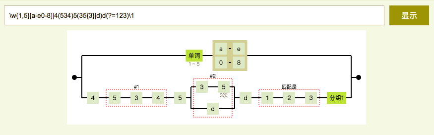

<p align='center'>
    <a href='https://hai2007.github.io/Regexper-Visualization/?express=%5Cw%7B1%2C5%7D%5Ba-e0-8%5D%7C4(534)5(35%7B3%7D%7Cd)d(%3F%3D123)%5C1&isString=no' target='_blank'>
        
    </a>
</p>

# Regexper-Visualization
正则表达式可视化

<p>
    <a href="https://github.com/hai2007/Regexper-Visualization/graphs/code-frequency" target='_blank'>
        
    </a>
    <a href="https://github.com/hai2007/Regexper-Visualization/graphs/commit-activity" target='_blank'>
        
    </a>
    <a href="https://github.com/hai2007/Regexper-Visualization" target='_blank'>
        
    </a>
</p >

## 如何启动本地编辑？

首先，你需要确保本地安装了node.js，然后，执行下面命令安装项目依赖：

```bash
npm install
```

接着，启动下面命令会自动打开页面，修改内容页面也自动刷新：

```bash
npm run dev
```

如果你想发布开发的代码，执行下面命令进行打包：

```bash
npm run build
```

开源协议
---------------------------------------
[MIT](https://github.com/hai2007/Regexper-Visualization/blob/master/LICENSE)

Copyright (c) 2021 [hai2007](https://hai2007.gitee.io/sweethome/) 走一步，再走一步。
